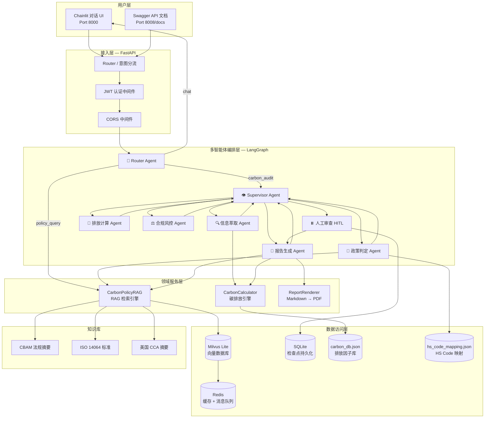
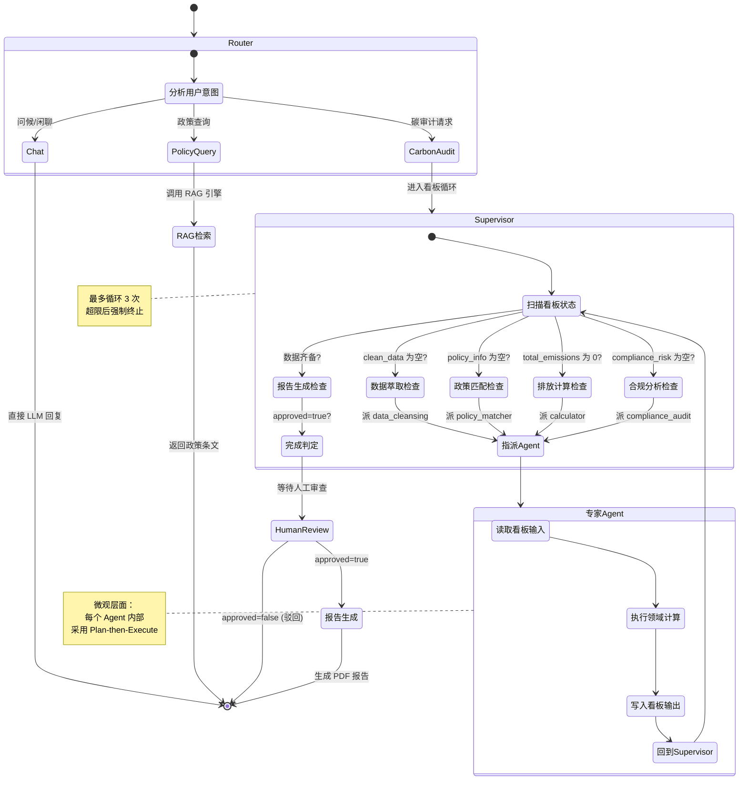
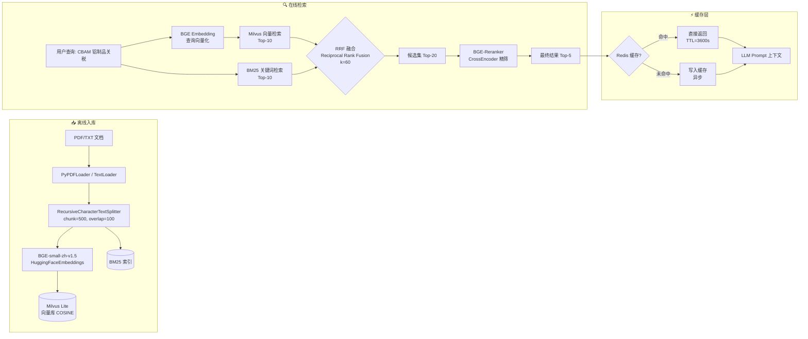
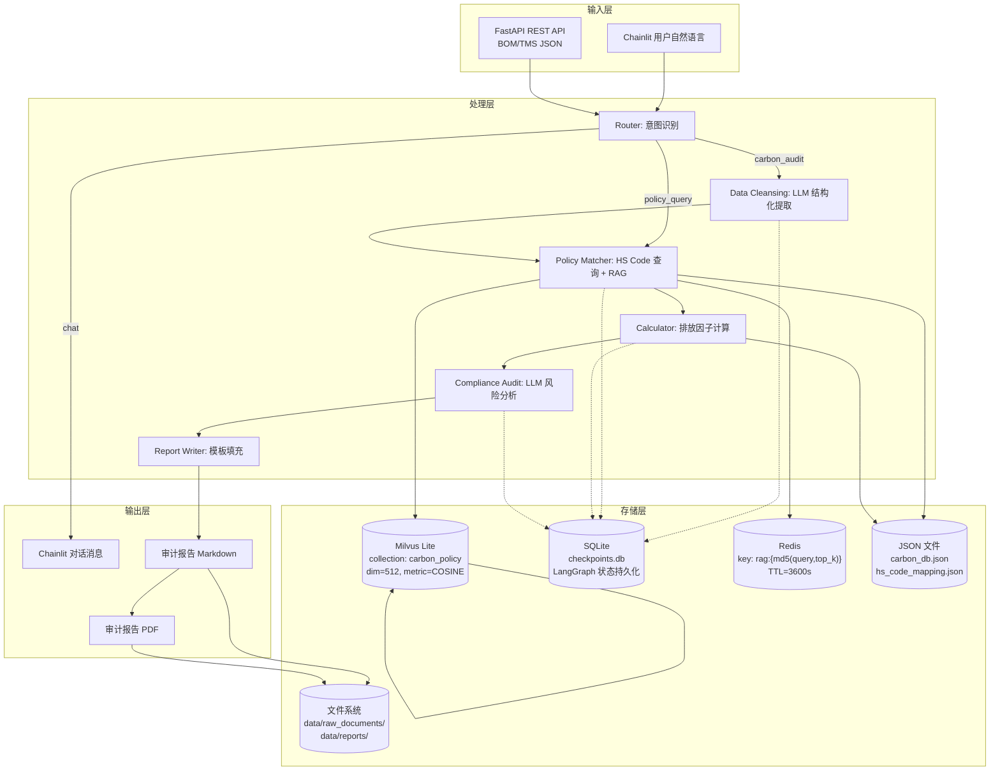
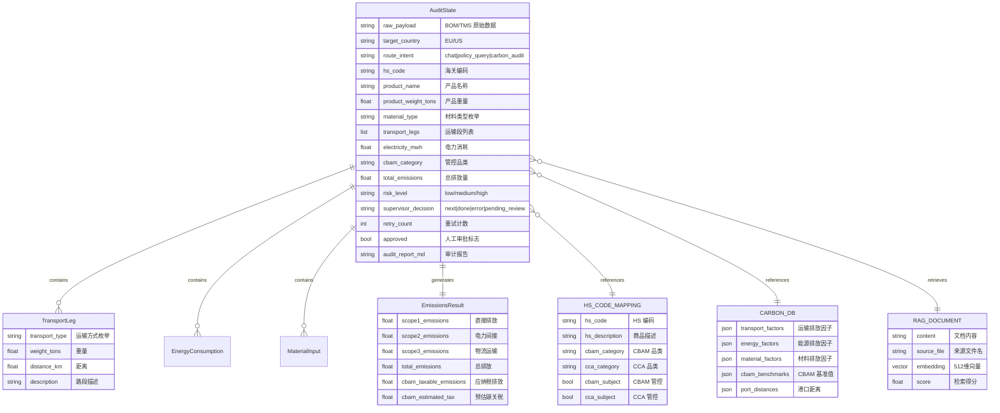
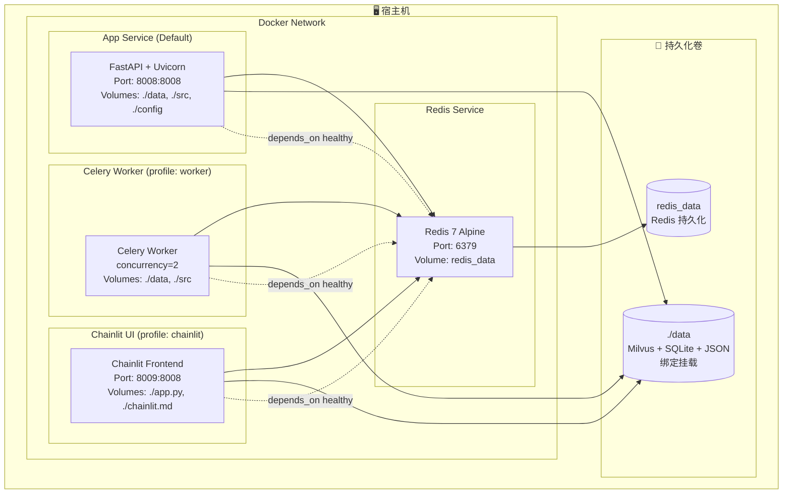

# 全球碳关税（CBAM/CCA）合规审计多智能体系统 — 技术说明文档

> **版本**: v2.0 | **日期**: 2026-07-11 | **架构模式**: 看板 + 监督者 复合多智能体编排

---

## 一、项目简介

### 核心价值

本系统是一款面向**跨境制造企业、物流企业和供应链咨询机构**的 AI 驱动碳关税合规审计平台。基于多智能体协同工作流，自动完成从**数据采集 → 政策匹配 → 碳排放计算 → 风险分析 → 报告生成**的全流程碳审计。

| 核心能力 | 说明 |
|----------|------|
| 🔍 多源数据接入 | 支持 BOM（物料清单）、TMS（运输管理）、海运提单数据导入 |
| 📜 智能政策匹配 | RAG 混合检索 CBAM/CCA 法规库，自动判定 HS Code 管控品类 |
| 🧮 全链路碳排放计算 | Scope 1（直接）/ Scope 2（电力）/ Scope 3（物流）三范围核算 |
| ⚖️ 合规风险分析 | 对标欧盟 CBAM / 美国 CCA 基准值，生成风险等级和整改建议 |
| ⏸️ 人工审查确认 | Human-in-the-Loop 机制，关键节点暂停等待人工审批 |
| 📝 审计报告自动化 | 生成 Markdown + PDF 双格式审计报告 |

### 技术特色

| 特色 | 说明 |
|------|------|
| 🏗️ 复合多智能体编排 | Router（路由分诊）+ Blackboard（看板共享）+ Supervisor（监督者仲裁）三层复合 |
| 🔄 动态监督者循环 | Supervisor 扫描看板状态，按需调度 Agent，非固定流水线 |
| 🎯 意图智能分流 | Router 识别闲聊/政策查询/碳审计，非审计请求不启动工作流 |
| 🧠 混合 RAG 检索 | Milvus 向量检索 + BM25 关键词 + RRF 融合 + BGE-Reranker 重排序 |
| 🔌 优雅降级 | Redis 不可用时自动降级（缓存跳过、Celery 禁用），核心功能不受影响 |
| 🐳 容器化就绪 | Docker Compose 一键部署，app/Redis/Celery/Chainlit 四种 profile |

---

## 二、技术栈

### 前端

| 技术 | 版本 | 用途 |
|------|------|------|
| Chainlit | >= 2.11.0 | 对话式 AI 交互界面，步骤可视化 + 审批按钮 |
| Python | 3.10+ | 前端逻辑语言（Chainlit 基于 Python） |

### 后端

| 技术 | 版本 | 用途 |
|------|------|------|
| Python | 3.10+ | 主开发语言 |
| FastAPI | >= 0.110.0 | REST API 框架，Swagger 自动文档 |
| Uvicorn | >= 0.29.0 | ASGI 异步服务器 |
| Pydantic | >= 2.0.0 | 请求/响应数据模型校验 |
| LangGraph | >= 0.2.39 | 多智能体工作流编排（StateGraph + HITL） |
| LangChain | >= 0.3.0 | LLM 应用框架（Prompt / Chain / OutputParser） |
| LangChain-OpenAI | >= 0.2.0 | OpenAI 兼容 LLM 客户端 |
| LangChain-HuggingFace | >= 0.1.0 | HuggingFace Embeddings 模型加载 |
| LangChain-Community | >= 0.3.0 | BM25 检索器、PDF/TXT 文档加载器 |
| LangChain-Text-Splitters | >= 0.3.0 | RecursiveCharacterTextSplitter 文档分块 |
| LangGraph-Checkpoint-SQLite | >= 2.0.0 | 工作流状态持久化（HITL 断点恢复） |
| LongCat-2.0 | - | LLM 推理模型（OpenAI 兼容 API） |
| PyMilvus | >= 2.4.0 | Milvus Lite 嵌入式向量数据库 |
| Sentence-Transformers | >= 3.0.0 | BGE Embedding + BGE-Reranker 模型 |
| pypdf | >= 4.0.0 | PDF 政策文档解析 |
| fpdf2 | >= 2.8.0 | PDF 审计报告渲染 |
| markdown | >= 3.6 | Markdown 解析 |
| python-multipart | >= 0.0.9 | FastAPI 文件上传 |

### 基础设施

| 技术 | 版本 | 用途 |
|------|------|------|
| Redis | 7.x | RAG 缓存 + Celery Broker + 速率限制 |
| Celery | >= 5.3.0 | 异步碳审计任务队列 |
| PyJWT | >= 2.8.0 | JWT Bearer Token 认证 |
| SQLite | stdlib | LangGraph 检查点 + Milvus Lite 底层存储 |
| JSON | - | 碳排放因子数据库 + HS Code 映射表 |
| Docker | - | 容器化部署 |
| Docker Compose | 3.9 | 多服务编排 |
| LangSmith | >= 0.1.0 | LLM 链路追踪（可选） |
| Fonts Noto CJK | - | Docker 镜像中文字体支持 |

---

## 三、系统架构设计

### 3.1 整体架构图



### 3.2 Agent 编排流程图（看板 + 监督者）



### 3.3 RAG 检索引擎流程图



### 3.4 数据流与存储架构



### 3.5 数据模型 ER 关系图



### 3.6 Docker 部署架构图



**Profile 说明**:

| 命令 | 启动服务 | 适用场景 |
|------|----------|----------|
| `docker compose up -d` | app + redis | 纯后端 API |
| `docker compose --profile worker up -d` | app + redis + celery | 异步任务 |
| `docker compose --profile chainlit up -d` | chainlit + redis | 前端对话 UI |
| `docker compose --profile prod --profile worker up -d` | 全部服务 | 生产全栈 |

---

## 四、项目结构总览

```
Project Root/
│
├── frontend/                          # 前端 — Chainlit 对话 UI
│   ├── app.py                         # 主入口（Router + 工作流 + 审批回调）
│   ├── chainlit.md                    # 欢迎页 Markdown
│   └── .chainlit/
│       └── config.toml                # Chainlit 配置
│
├── backend/                           # 后端 — FastAPI + LangGraph
│   ├── main.py                        # ⭐ 主入口（uvicorn 启动）
│   │
│   ├── config/
│   │   └── settings.py                # 全局配置（LLM/DB/Redis/JWT/Celery）
│   │
│   ├── src/
│   │   ├── api/                       # 🌐 接入层（FastAPI）
│   │   │   ├── app.py                 # 应用工厂（create_app）
│   │   │   ├── schemas.py             # Pydantic 请求/响应模型
│   │   │   ├── deps.py                # 依赖注入
│   │   │   └── routes/                # 路由层
│   │   │       ├── auth.py            # POST /auth/token
│   │   │       ├── audit.py           # /audit/start, /status, /approve
│   │   │       └── rag.py             # /rag/upload, /rag/search
│   │   │
│   │   ├── domain/                    # 🧠 领域层（碳审计核心）
│   │   │   ├── calculator.py          # 碳排放计算引擎（Scope 1/2/3）
│   │   │   ├── rag.py                 # RAG 混合检索引擎
│   │   │   ├── report_renderer.py     # Markdown → PDF 渲染
│   │   │   ├── agents/                # 智能体节点
│   │   │   │   ├── router.py          # 🆕 路由 Agent（意图分流）
│   │   │   │   ├── supervisor.py      # 🆕 监督者 Agent（控制循环）
│   │   │   │   ├── data_cleansing.py  # 信息萃取 Agent
│   │   │   │   ├── policy_matcher.py  # 政策判定 Agent (RAG)
│   │   │   │   ├── calculator.py      # 排放计算 Agent
│   │   │   │   ├── compliance_audit.py # 合规风控 Agent
│   │   │   │   └── report_writer.py   # 报告生成 Agent
│   │   │   └── workflows/             # LangGraph 工作流
│   │   │       ├── state.py           # AuditState TypedDict（看板状态）
│   │   │       └── graph.py           # StateGraph 构建（看板+监督者）
│   │   │
│   │   ├── data/                      # 💾 数据访问层
│   │   │   └── database.py            # Milvus + JSON 数据读写
│   │   │
│   │   └── infrastructure/            # 🔧 基础设施层
│   │       ├── cache.py               # Redis 缓存 + 速率限制
│   │       ├── auth.py                # JWT 认证（创建/验证/依赖注入）
│   │       ├── celery_app.py          # Celery 实例配置
│   │       └── celery_tasks.py        # 异步审计任务
│   │
│   ├── tests/                         # 🧪 测试
│   │   ├── conftest.py                # pytest fixtures
│   │   ├── test_calculator.py         # 碳排放计算测试（6 个）
│   │   ├── test_auth.py               # JWT 认证测试（7 个）
│   │   └── test_cache.py              # Redis 缓存测试（5 个）
│   │
│   ├── data/                          # 📦 数据文件
│   │   ├── carbon_db.json             # 碳排放因子数据库
│   │   ├── hs_code_mapping.json       # HS Code 映射表（16 条）
│   │   ├── raw_documents/             # RAG 知识库文档
│   │   │   ├── cbam_regulation_summary.txt
│   │   │   ├── iso_14064_summary.txt
│   │   │   └── us_cca_summary.txt
│   │   └── reports/                   # 生成的审计报告目录
│   │
│   ├── requirements.txt               # Python 依赖清单
│   ├── .env.example                   # 环境变量模板
│   ├── Dockerfile                     # Docker 镜像
│   ├── .dockerignore
│   └── docker-compose.yml             # 多服务编排（4 profile）
│
├── docs/                              # 📖 项目文档
│   ├── 需求文档.md
│   ├── 项目实现计划.md
│   ├── 启动与运维指南.md
│   └── 技术说明文档.md                # ← 本文档
│
├── README.md                          # 项目 README
└── .gitignore
```

### 目录职责速查

| 目录 | 职责 | 改动频率 |
|------|------|----------|
| `frontend/` | Chainlit 对话 UI | 中 |
| `backend/main.py` | 启动入口 | 低 |
| `backend/config/` | 全局配置 | 低 |
| `backend/src/api/` | REST API 接入层 | 中 |
| `backend/src/domain/agents/` | Agent 节点逻辑 | **高** |
| `backend/src/domain/workflows/` | 图编排 + 状态定义 | **高** |
| `backend/src/domain/calculator.py` | 碳排放领域引擎 | 中 |
| `backend/src/domain/rag.py` | RAG 检索引擎 | 中 |
| `backend/src/domain/report_renderer.py` | PDF 渲染 | 低 |
| `backend/src/data/` | 数据访问 | 低 |
| `backend/src/infrastructure/` | 横切基础设施 | 低 |
| `backend/tests/` | 单元测试 | 中 |
| `backend/data/` | 静态数据文件 | 低 |

### 层间依赖关系

```
frontend/app.py ──→ backend/src/domain/ ──→ backend/src/data/
                         │                      │
                         ▼                      ▼
                  backend/src/           backend/data/
                  infrastructure/        (JSON/SQLite/
                      │                 Milvus/Redis)
                      ▼
                  backend/config/
                  settings.py
```

- `frontend/` 依赖 `backend/`（通过 sys.path）
- `api/` 依赖 `domain/` + `infrastructure/`
- `domain/` 依赖 `data/` + `infrastructure/` + `config/`
- `infrastructure/` 依赖 `config/`
- **层间单向依赖，无循环引用**

